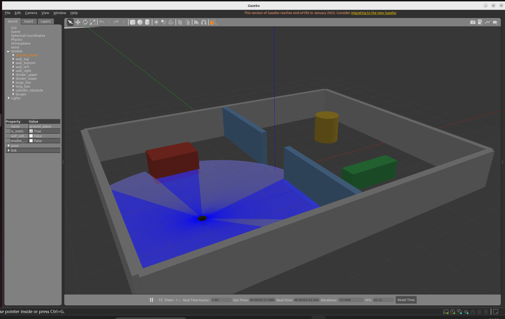
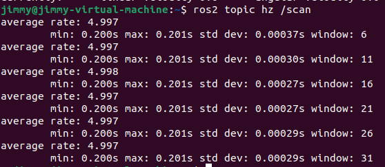
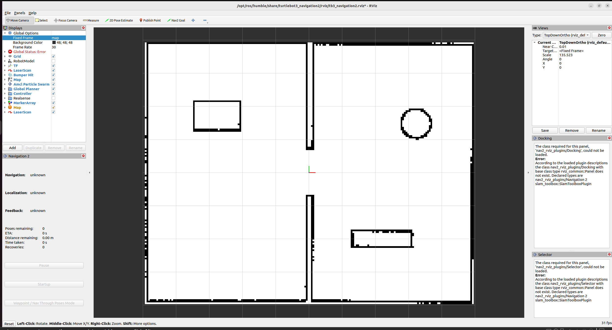
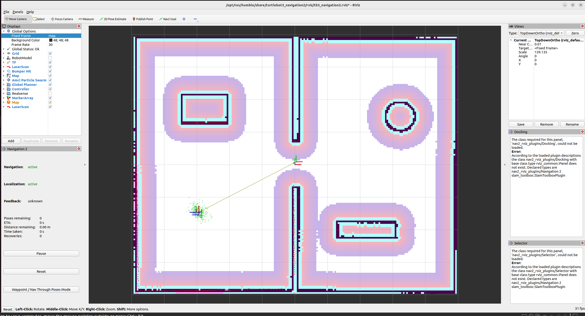
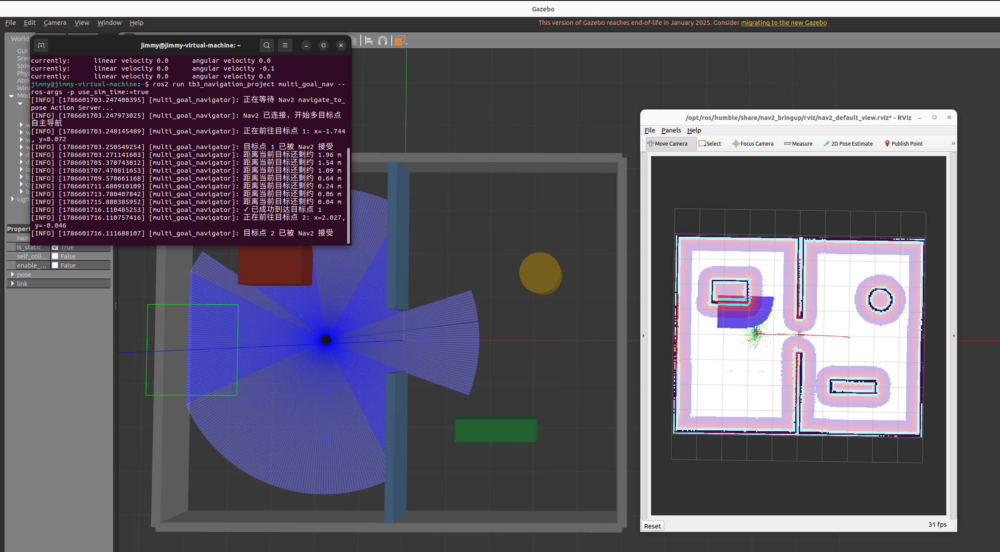
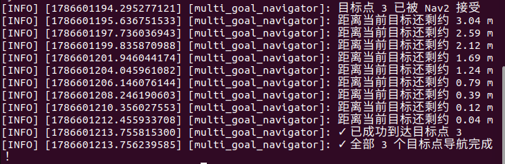

# 第2次进度汇报

**时间范围：** 2026年8月3日—2026年8月13日  
**汇报人：** 袁崇皓  
**当前任务：** Gazebo 仿真环境、SLAM 建图、Nav2 自主导航与 Python 多目标点自主导航  

---

## 一、本阶段成果简述

本阶段在上一阶段完成 ROS 2 基础学习和 Python 通信程序练习的基础上，正式进入第一阶段考核任务的基础任务部分，重点完成以下四项内容：

1. 搭建符合要求的 Gazebo 自定义仿真环境，并验证 TurtleBot3 与激光雷达等传感器能够正常工作；
2. 使用 TurtleBot3 遍历环境，通过 SLAM Toolbox 完成二维地图构建并保存地图；
3. 加载已保存地图，启动 Nav2 与 RViz2，完成机器人定位、目标点设置、自主路径规划和避障导航；
4. 使用 Python 编写 ROS 2 自主导航节点，通过 Nav2 `NavigateToPose` Action 依次发送多个目标点，实现 TurtleBot3 多目标点连续自主导航。


---

## 二、已完成内容

### 1. 任务1：Gazebo 自定义仿真环境搭建

完成了 TurtleBot3 仿真环境的搭建，并创建自定义 Gazebo World。

主要完成内容：

- 创建并调试自定义 `assessment_world.world`；
- 环境包含多个相互连通的独立区域、墙体、通道和障碍物，满足封闭环境要求；
- 在 Gazebo 中成功加载 TurtleBot3 Burger；
- 验证机器人能够在环境中正常生成并运动；
- 验证激光雷达相关话题能够正常发布数据；
- 使用终端查看传感器话题信息，并完成任务要求的运行结果截图。

目前已经能够理解 Gazebo 中“世界模型”和“机器人模型”的基本关系：

```text
World
├── 地面与墙体
├── 障碍物
└── TurtleBot3
    ├── 底盘
    ├── 轮子
    └── 激光雷达
```

本任务最终形成了可供后续 SLAM 与 Nav2 直接使用的统一仿真环境。



> 图1 任务1：自定义 Gazebo World 与 TurtleBot3 激光雷达扫描效果



> 图2 任务1：使用 `ros2 topic hz /scan` 验证激光雷达话题稳定发布，频率约为 5 Hz


---

### 2. 任务2：SLAM 建图

在任务1的自定义 World 基础上，完成了 TurtleBot3 的二维 SLAM 建图。

主要完成内容：

- 启动 Gazebo 与 TurtleBot3；
- 启动 SLAM Toolbox；
- 使用 RViz2 实时查看激光扫描；
- 使用 Python 控制脚本驱动机器人自动遍历环境；
- 针对机器人容易卡在障碍物、局部区域覆盖不足等问题，多次修改自动探索脚本；
- 对门口、通道和局部未扫描区域使用键盘控制进行人工补图；
- 对地图中的空白区域、障碍物边缘和房间轮廓进行检查；
- 最终获得完整度较高、轮廓较清晰的二维地图；
- 成功保存地图文件，为后续 Nav2 导航提供静态地图。

地图保存结果包括：

```text
map.yaml
map.pgm
```

其中：

- `.pgm` 保存二维栅格地图图像；
- `.yaml` 保存地图分辨率、原点位置、占用阈值和图像文件路径等参数。




> 图3 任务2：SLAM 建图完成后的二维 Occupancy Grid，房间轮廓及主要障碍物均已形成


---

### 3. 任务3：基于已保存地图的 Nav2 自主导航

完成地图后，继续搭建基于静态地图的 Nav2 导航流程。

主要完成内容：

- 加载任务2保存的地图；
- 启动 Gazebo 与 TurtleBot3；
- 启动 Nav2 导航相关节点；
- 在 RViz2 中显示地图、机器人、激光雷达和导航信息；
- 使用 `2D Pose Estimate` 完成机器人初始位姿设置与定位；
- 使用 `2D Goal Pose` 设置导航目标点；
- 验证 Nav2 能够生成从当前位置到目标位置的全局路径；
- 验证机器人能够按照规划路径自主移动；
- 在 Gazebo 中加入静态障碍物，观察机器人局部避障和重新规划行为；
- 多次测试地图加载、定位和导航流程。




> 图4 任务3：加载静态地图后完成 AMCL 定位，并启动 Nav2 全局/局部代价地图用于自主导航

通过本任务，对“建图”和“导航”之间的区别有了更加明确的理解：

- SLAM 阶段：地图未知，需要机器人边移动边估计自身位姿并建立地图；
- Nav2 阶段：地图已经存在，机器人主要完成定位、路径规划、避障和运动控制。

---

### 4. 任务4：Python 多目标点自主导航节点

在任务3已经完成单目标点 Nav2 自主导航的基础上，进一步使用 Python 编写 ROS 2 节点，实现多个目标点之间的连续自主导航。

主要完成内容：

- 编写 `multi_goal_nav.py`；
- 创建 Nav2 `NavigateToPose` 的 Action Client，并与 `/navigate_to_pose` 动作接口通信；
- 在程序中预先设置 3 个导航目标点；
- 按照既定顺序依次向 Nav2 发送目标；
- 在每个目标执行过程中等待导航结果，并根据返回状态判断是否成功到达；
- 在终端输出当前目标点编号、目标坐标以及导航完成状态；
- 对目标请求被拒绝、导航失败等情况加入基本异常与状态处理；

本次测试使用的三个目标点为：

```text
目标点1：(-1.744, 0.072)
目标点2：( 2.027, -0.046)
目标点3：( 2.789, 2.863)
```

程序运行逻辑如下：

```text
启动节点
   ↓
连接 Nav2 NavigateToPose Action Server
   ↓
发送目标点1
   ↓
等待导航结果
   ↓
到达目标点1
   ↓
发送目标点2
   ↓
等待导航结果
   ↓
到达目标点2
   ↓
发送目标点3
   ↓
等待导航结果
   ↓
到达目标点3
   ↓
全部目标点导航完成
```

最终实测中，TurtleBot3 能够按照设定顺序依次完成 3 个目标点的自主导航，终端能够正确输出各目标点的执行状态，并最终输出：

```text
✓ 已成功到达目标点 1
✓ 已成功到达目标点 2
✓ 已成功到达目标点 3
✓ 全部 3 个目标点导航完成！
```

说明 Python 节点已经能够正常与 Nav2 导航栈通信，并完成“Python 节点 → Action Client → Nav2 → 路径规划与控制 → TurtleBot3”的完整控制链路。



> 图5 任务4：运行 Python 多目标自主导航节点后，TurtleBot3 按顺序前往预设目标点



> 图6 任务4：终端输出三个目标点的导航执行状态，三个目标点均成功到达

通过本任务，对 ROS 2 中 Topic、Service 与 Action 三种通信方式的使用场景有了进一步区分。其中，导航任务具有执行时间较长、需要反馈执行状态并最终返回结果等特点，因此使用 Action 机制更适合完成 Nav2 自主导航控制。

---

## 三、遇到的问题及解决情况

### 1. SLAM 自动探索过程中机器人容易卡住

最初的自动探索脚本在靠近墙体或障碍物时容易进入局部循环，机器人可能持续旋转或无法继续遍历。

处理方式：

- 多次调整运动策略；
- 增加对障碍物距离的判断；
- 调整直行与转向逻辑；
- 避免机器人长时间贴墙或在狭窄区域反复转向。

通过多轮测试后，自动遍历稳定性得到改善。

---

### 2. 自动探索无法保证地图完全覆盖

即使机器人能够遍历大部分环境，部分门口、墙角和狭窄区域仍可能出现未扫描区域。

处理方式：采用自动与人工结合的方式提高地图完整度。

---


## 四、当前不足

- 对 SLAM Toolbox 内部的位姿图优化等算法原理仍只停留在基本概念层面；
- 对 AMCL 粒子滤波定位原理还没有深入学习；
- 对 ROS 2 Action 的 Goal、Feedback、Result 等完整通信机制还需要进一步理解；
- 对 ROS 2 lifecycle node 和 Nav2 启动顺序的理解还需要继续加强；

---

