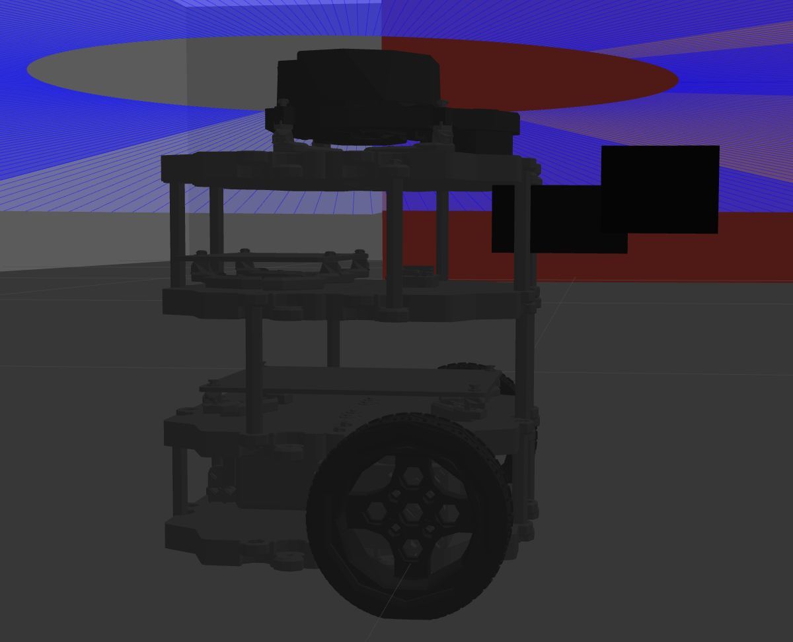
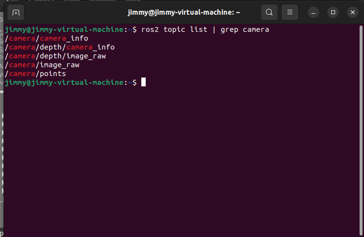
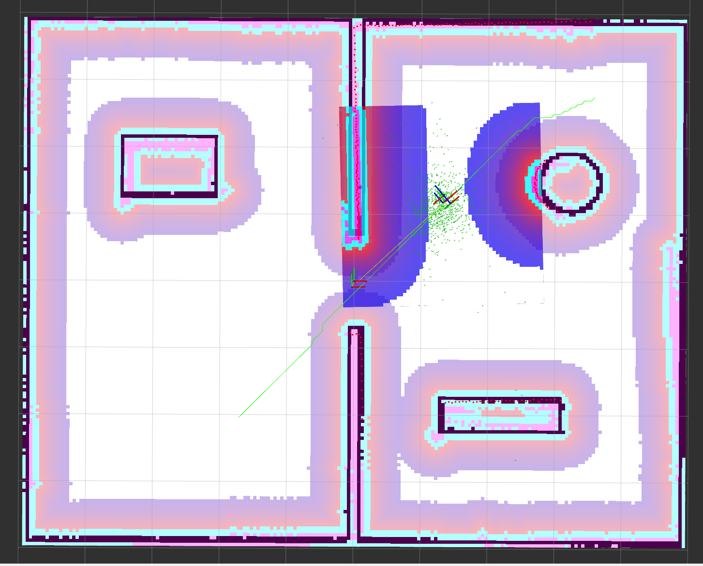
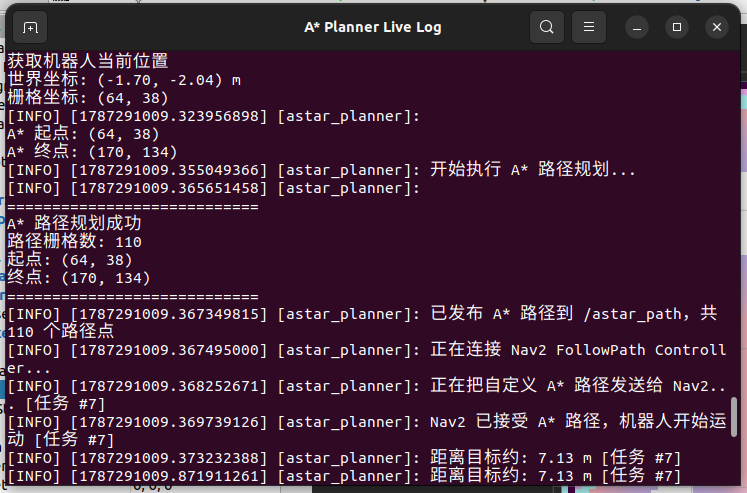
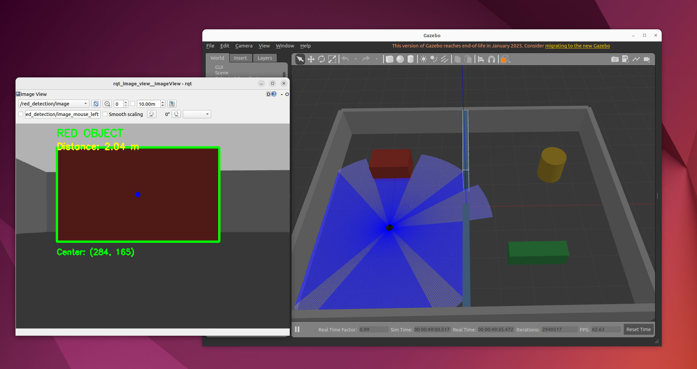

# 第3次进度汇报

**时间范围：** 2026年8月14日—2026年8月27日  
**汇报人：** 袁崇皓  
**当前任务：** 附加任务1 RGB-D 摄像头集成、附加任务2 自定义 A* 路径规划器集成与附加任务3 RGB-D 视觉感知  

---

## 一、本阶段成果简述

本阶段在前期已经完成 Gazebo 自定义环境、SLAM 建图、Nav2 自主导航和 Python 多目标点导航的基础上，继续完成第一阶段考核的附加任务。
重点完成以下三项内容：

1. 在 TurtleBot3 仿真模型中加入 RGB-D 摄像头，并完成模型位置调整及相关话题发布验证；
2. 使用 Python 自主实现 A* 路径规划算法，将 ROS 2 OccupancyGrid 转换为自定义规划栅格，并通过 Nav2 `FollowPath` Action 将自定义路径直接交给 Controller Server 执行，实现“自定义 A* 规划 → RViz2 路径显示 → Nav2 路径跟踪 → TurtleBot3 实际运动”的完整链路；
3. 基于已集成的 RGB-D 摄像头，使用 Python + OpenCV 实现简单视觉目标检测，对 Gazebo 环境中的红色障碍物进行实时识别，并进一步结合深度图计算目标距离，形成“RGB 图像检测 + Depth 距离估计”的完整视觉感知链路。

此外，在调试附加任务2的过程中继续完善统一启动工具，将自定义 A* 导航加入独立启动选项，并增加 A* Planner 实时日志窗口，减少重复启动节点和手工输入命令造成的干扰。

---

## 二、已完成内容

### 1. 附加任务1：RGB-D 摄像头集成

在原有 TurtleBot3 Burger 仿真模型基础上加入 RGB-D 摄像头，并完成模型加载和传感器数据验证。

主要完成内容：

- 在 Gazebo 仿真环境中加载 RGB-D 摄像头模型；
- 调整摄像头与 TurtleBot3 车体之间的相对安装位置；
- 检查摄像头是否能够随机器人模型一起正常运动；
- 验证 RGB-D 摄像头相关 ROS 2 话题能够正常建立并发布；
- 对最终模型和相关话题信息进行截图留档。

RGB-D 摄像头加入后，机器人除原有激光雷达外，进一步具备了视觉和深度信息获取接口，为后续视觉感知类任务提供了传感器基础。



> 图1 附加任务1：Gazebo 中 TurtleBot3 与 RGB-D 摄像头模型集成结果



> 图2 附加任务1：RGB-D 摄像头相关 ROS 2 话题发布情况

---

### 2. 附加任务2：Python 自定义 A* 路径规划器

#### 2.1 任务简介
本阶段的主要工作是将原本由 Nav2 默认全局规划器完成的路径规划部分替换为自主实现的 A* 算法。

自定义规划器主要完成：

- 使用 `rclpy` 编写 ROS 2 Python 节点；
- 订阅 `/map`，读取 `nav_msgs/OccupancyGrid`；
- 将 ROS 地图转换为二维 A* 栅格；
- 通过 TF 获取机器人在 `map` 坐标系下的当前位置；
- 通过 RViz2 `Publish Point` 获取用户点击目标；
- 将起点和终点由世界坐标转换为地图栅格坐标；
- 使用 Python 实现 A* 搜索；
- 将最终栅格路径转换为 `nav_msgs/Path`；
- 将自定义路径发布到 `/astar_path`；
- 在 RViz2 中显示自定义 A* 路径；
- 通过 Nav2 `FollowPath` Action 将路径交给 DWB Controller 执行。

整体结构为：

```text
RViz2 Publish Point
        ↓
/clicked_point
        ↓
自定义 A* Planner
        ↓
/map + TF
        ↓
A* 栅格搜索
        ↓
nav_msgs/Path
      ↙      ↘
/astar_path   FollowPath Action
    ↓              ↓
 RViz2       Nav2 Controller
                    ↓
                 /cmd_vel
                    ↓
               TurtleBot3
```

与之前任务四的 `NavigateToPose` 不同，本任务中 Python 节点不再只是向 Nav2 提供目标点，而是直接生成完整路径，因此能够验证自定义规划算法与 Nav2 控制部分之间的集成。

---

#### 2.2 A* 算法实现与路径安全处理

A* 使用：

```text
f(n) = g(n) + h(n)
```

其中：

- `g(n)` 为起点到当前节点的实际累计代价；
- `h(n)` 为当前节点到目标点的启发式估计；
- 本任务的 `h(n)` 使用欧氏距离。

规划器采用 8 邻域搜索：水平和垂直移动代价为 `1`，斜向移动代价为 `sqrt(2)`。

```text
  ↖ ↑ ↗
  ←    →
  ↙ ↓ ↘    
```


在障碍物安全距离处理方面，最终采用：

```text
硬障碍膨胀              #半径为 3 个栅格，对应约0.15m
     +
障碍物附近软代价        #cost = 2.5 * ((8 - d) / 5) ** 2
```
---

#### 2.3. 自定义路径与 Nav2 Controller 集成

职责划分为：

```text
自定义 A*
    ↓
负责全局路径生成

Nav2 DWB Controller
    ↓
负责实际路径跟踪和速度控制
```



> 图3 附加任务2：RViz2 中显示的自定义 `/astar_path`，路径能够穿过地图通道并绕开主要障碍区域



> 图4 附加任务2：A* Planner Live Log 显示路径规划完成、自定义路径发布并被 Nav2 `FollowPath` 接受执行

---


### 3. 附加任务3：RGB-D 视觉感知与红色目标检测

在附加任务1已经完成 RGB-D 摄像头集成的基础上，本阶段继续使用机器人相机完成视觉感知任务。


视觉检测部分使用 Python + OpenCV 实现，整体流程为：

```text
/camera/image_raw
        ↓
cv_bridge 转换为 OpenCV 图像
        ↓
BGR → HSV
        ↓
红色区域阈值分割
        ↓
形态学开运算 + 闭运算
        ↓
轮廓检测
        ↓
选择最大红色目标
        ↓
Bounding Box + 目标中心
```

由于 Gazebo 环境中的目标为深红色障碍物，因此使用两段 HSV 红色区间：

```text
H: 0~10
或
H: 170~179
S: 100~255
V: 40~255
```

并使用轮廓面积阈值过滤小面积噪声。

检测到目标后，程序能够在图像中显示：

```text
RED OBJECT
Bounding Box
Center: (cx, cy)
```

在此基础上，进一步订阅：

```text
/camera/depth/image_raw
```

为了减少单个深度像素出现 NaN、Inf 或局部噪声带来的影响，不直接读取单点深度，而是取目标中心附近 `7×7` 区域中的有效深度值，并使用中位数作为目标距离估计。

最终检测结果同时显示：

```text
RED OBJECT
Distance: 2.65 m
Center: (342, 181)
```

检测后的图像重新发布至：

```text
/red_detection/image
```

并可通过 `rqt_image_view` 实时查看。



> 图5 附加任务3：RGB-D 相机对 Gazebo 中红色障碍物进行实时检测。绿色矩形框为目标 Bounding Box，蓝色点为目标中心，同时显示目标中心坐标与深度距离。

本任务最终形成：

```text
RGB-D Camera
      ↓
RGB + Depth Topics
      ↓
Python / OpenCV
      ↓
HSV Target Detection
      ↓
Bounding Box + Center
      ↓
Depth Distance Measurement
      ↓
/red_detection/image
```

相比只完成普通 RGB 目标检测，本阶段进一步利用了 RGB-D 相机的深度信息，使机器人能够同时获得目标类别位置与距离信息。


## 三、遇到的问题及解决情况

### 1. 路径在门口附近过于贴墙

现象：

单纯追求栅格最短路径时，A* 可能生成靠近墙体的路径；如果直接增加较大的硬膨胀，又会明显压缩门口的可通行空间。

处理方式：

将安全策略调整为“较小硬膨胀 + 障碍物软代价”。硬膨胀保证最低安全距离，软代价用于引导路径在有空间时主动远离墙体。

---

### 2. FollowPath 返回状态与机器人实际目标距离不一致

现象：

调试过程中曾出现 Nav2 `FollowPath` 已经返回结束状态，但机器人仍未真正到达用户点击目标的情况。

处理方式：

在 Python 节点中增加独立的实际距离判断，通过 TF 获取机器人当前位置，并与 A* 最终目标坐标计算欧氏距离，不再只依赖 Action 返回状态判断是否真正到达。

---


### 3. 单个深度像素存在不稳定风险

现象：

如果直接读取目标中心一个像素对应的深度值，可能出现 NaN、Inf 或局部异常值。

处理方式：

取目标中心附近 `7×7` 深度区域，过滤无效值后取中位数作为距离，从而提高目标距离显示的稳定性。


## 四、当前不足

1. 当前 A* 输出仍以二维栅格折线路径为主，尚未进一步加入连续曲线级的路径平滑；
2. 附加任务3目前采用基于 HSV 颜色阈值的简单目标检测，对颜色变化、光照变化和复杂背景的适应能力有限；
3. 当前视觉部分只针对一个明显红色目标进行验证，尚未扩展到多类别目标识别；
4. 对 DWB 各 Critic、Nav2 Controller Server、TF 时间同步机制以及 RGB-D 数据对齐等底层机制还需要继续深入理解；

