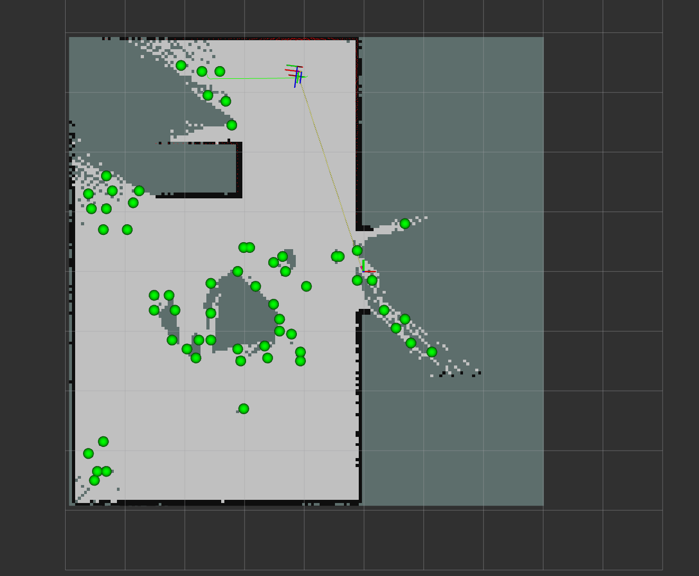
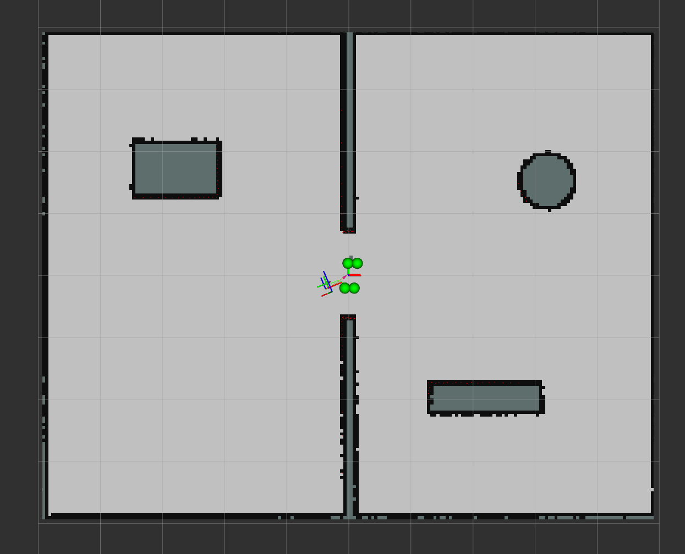

# 第4次进度汇报

**时间范围：** 2026年8月28日—2026年9月9日  
**汇报人：** 袁崇皓  
**当前任务：** 附加任务4 Frontier-based 自主环境探索与统一启动工具完善  

---

## 一、本阶段成果简述

本阶段在前期已经完成 Gazebo 自定义环境、SLAM 建图、Nav2 自主导航、Python 多目标点导航，以及附加任务1～3的基础上，继续完成第一阶段考核的附加任务4“自主环境探索”。

本阶段重点完成以下两项内容：

1. 使用 Python + ROS 2 自主实现 Frontier-based 自主探索节点，对 SLAM 地图中的未知区域边界进行检测、聚类、候选点生成与评分，并通过 Nav2 `NavigateToPose` Action 驱动 TurtleBot3 自动前往未探索区域，实现“Frontier 检测 → 自动选点 → Nav2 导航 → SLAM 地图扩展 → 再次探索”的完整闭环；
2. 在自主探索逻辑基础上增加失败目标黑名单、障碍物安全距离、导航超时、探索完成判定和地图自动保存，并将附加任务4加入已有 ROS2 Robot Toolbox，实现 Gazebo、SLAM、Nav2、RViz 和 Frontier Explorer 的一键启动。

最终机器人能够在不使用键盘控制、不手动发送导航目标的情况下，自主完成封闭环境探索，并自动保存最终地图。

---

## 二、已完成内容

### 1. 附加任务4：Frontier-based 自主环境探索

#### 1.1 Frontier 检测

主要使用以下三类栅格状态：

```text
-1    Unknown
 0    Free
100   Occupied
```

Frontier 定义为：当前栅格属于已知空闲区域，同时其 8 邻域中至少存在一个未知栅格。

检测流程为：

```text
/map
  ↓
OccupancyGrid
  ↓
遍历 Free Cell
  ↓
检查 8 邻域
  ↓
是否存在 Unknown Cell
  ↓
Frontier Cell
```

初始地图中能够稳定检测到大量 Frontier 栅格，为后续自主探索提供候选区域。

---

#### 1.2 Frontier 聚类与候选点生成

如果直接将所有 Frontier 栅格作为导航目标，会产生大量重复目标，因此使用 BFS 对相邻 Frontier Cell 进行聚类。

聚类流程为：

```text
Frontier Cells
      ↓
8 邻域 BFS
      ↓
Frontier Clusters
```

最终形成：

```text
Frontier Cell
      ↓
BFS Cluster
      ↓
Spatial Subdivision
      ↓
Navigation Candidate
```

候选点通过 `visualization_msgs/MarkerArray` 发布至：

```text
/frontier_candidates
```

并在 RViz2 中显示为绿色球形 Marker，便于观察算法选择的潜在探索目标。

---

#### 1.3 Frontier 候选点评分与 Nav2 自主导航

为了使机器人能够自主决定下一步探索方向，对所有候选点进行筛选和评分。

首先过滤：

```text
距离机器人过近的目标
+
失败目标黑名单附近的目标
+
距离障碍物过近的目标
```

候选点评分主要考虑 Frontier 信息量和导航距离，当前采用：

```text
score = information_gain / (distance + 0.5)
```

其中：

- `information_gain` 使用候选点所在局部 Frontier 区域的栅格数量表示；
- `distance` 为机器人当前位置到候选点的欧氏距离；
- Frontier 越大，代表潜在未知区域越多；
- 距离越短，代表导航代价越低。

程序通过 TF 获取：

```text
map → base_link
```

从而得到机器人在 `map` 坐标系中的实时位置。

选出最佳候选点后，通过 Nav2：

```text
/navigate_to_pose
```

发送 `NavigateToPose` Action Goal。

整体导航闭环为：

```text
SLAM /map
    ↓
Frontier Detection
    ↓
Frontier Clustering
    ↓
Candidate Generation
    ↓
Candidate Scoring
    ↓
Best Frontier
    ↓
NavigateToPose
    ↓
Nav2 Planner + Controller
    ↓
TurtleBot3
    ↓
环境被进一步扫描
    ↓
SLAM 地图更新
    ↓
重新检测 Frontier
```

机器人能够在不手动使用 RViz2 `2D Goal Pose` 的情况下，自主选择目标并连续探索环境。



> 图1 附加任务4：TurtleBot3 根据 Frontier 候选点自主选择目标并通过 Nav2 进行导航探索，SLAM 地图在机器人运动过程中持续扩展。


---

#### 1.4 导航失败处理与黑名单机制

实际探索过程中，部分 Frontier 可能由于地图边缘、障碍物附近空间不足或局部规划失败而无法正常到达。

因此增加失败目标黑名单机制：

```text
Navigation Failed
       ↓
记录失败目标坐标
       ↓
Blacklist
       ↓
后续候选点评分时过滤附近区域
```

当前黑名单半径设置为：

```text
0.6 m
```

同时增加单目标导航超时机制：

```text
Navigation Timeout = 60 s
```

如果机器人长时间无法到达当前目标，则取消该 Goal，并将其加入黑名单，避免程序持续尝试同一个不可达目标。

---

#### 1.5 障碍物安全距离处理

为了减少候选 Frontier 位于墙边或障碍物附近造成的导航失败，在候选点生成阶段增加障碍物安全检查。

当前设置：

```text
Obstacle Clearance = 0.20 m
```

对于候选 Frontier Cell，在其周围一定半径内检查 OccupancyGrid，如果存在明显障碍栅格，则不将该点作为有效导航候选。

该处理能够减少机器人前往墙边、障碍物边缘等不稳定目标的情况。

---

#### 1.6 探索完成判定

在地图基本探索完成后，SLAM 地图边缘仍可能残留少量 Frontier 噪声，因此不能简单使用：

```text
Candidates == 0
```

作为唯一结束条件。

最终采用：

```text
Frontier 数量 <= 15
        +
连续 5 次没有有效候选点
        ↓
Exploration Completed
```

实际测试中，地图基本完整后出现：

```text
Frontier: 8
Clusters: 1
Candidates: 1
No valid candidate
```

程序能够连续进行完成条件检查，并最终输出：

```text
EXPLORATION COMPLETED!
No meaningful frontier remains.
```

从而避免节点在探索完成后持续重复输出无效候选信息。

---

#### 1.7 自动保存最终地图

探索完成后，程序自动调用 `nav2_map_server` 的 `map_saver_cli` 保存最终 SLAM 地图。

输出文件为：

```text
autonomous_exploration_map.yaml
autonomous_exploration_map.pgm
```
最终实现：

```text
自主探索
    ↓
完成判定
    ↓
停止继续选点
    ↓
自动保存地图
```



> 图2 附加任务4：TurtleBot3 完成 Frontier-based 自主环境探索后的最终 SLAM 地图，主要房间、通道与障碍物轮廓已完成建图。


---

### 2. RViz2 Frontier 可视化

为了方便调试 Frontier 选点效果，在 RViz2 中加入：

```text
Map          → /map
LaserScan    → /scan
Path         → /plan
MarkerArray  → /frontier_candidates
TF
RobotModel
```

其中 `MarkerArray` 专门用于显示 Frontier Explorer 生成的候选探索点。

候选点使用绿色球形 Marker 表示：

```text
Green Sphere = Frontier Navigation Candidate
```

---

## 三、遇到的问题及解决情况

### 1. Frontier Explorer 无法通过 `ros2 run` 启动

现象：

最初运行：

```text
ros2 run tb3_navigation_project frontier_explorer
```

出现：

```text
No executable found
```

进一步检查发现 `setup.py` 中 `console_scripts` 的字符串和逗号配置错误，导致 `multi_goal_nav` 与 `frontier_explorer` 的 entry point 被错误拼接。

处理方式：

重新整理 `setup.py`，将 `multi_goal_nav` 与 `frontier_explorer` 分别注册为独立 ROS 2 Python executable，并重新执行 `colcon build`。最终 `ros2 pkg executables tb3_navigation_project` 能够正确识别两个节点，Frontier Explorer 正常运行。

---

### 2. 大量 Frontier 被识别为一个连续 Cluster

现象：

初始检测结果中最大的 Frontier Cluster 包含约 669 个栅格。如果直接取整个 Cluster 的几何中心，目标点可能位于已探索区域内部，不能代表实际探索方向。

处理方式：

在 BFS 聚类基础上增加 Spatial Subdivision，将大 Cluster 进一步按照局部地图区域拆分，并分别生成候选 Frontier。

最终从单个大型 Frontier 中生成多个分散候选点，使机器人能够向不同方向进行探索。

---

### 3. 探索完成后仍存在少量 Frontier

现象：

地图基本完成后仍存在少量地图边缘 Frontier，例如：

```text
Frontier: 8
Candidates: 1
```

但该候选点可能过近、已进入黑名单或没有继续探索价值，导致程序不断输出：

```text
No valid candidate available.
```

处理方式：

增加连续完成判定：

```text
Frontier <= 15
+
连续 5 次无有效候选点
```

满足后正式进入 `EXPLORATION COMPLETED`，并自动保存最终地图。

---
