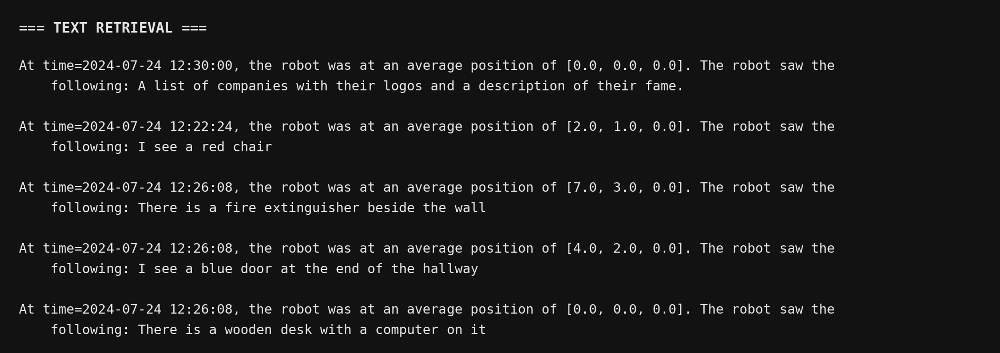
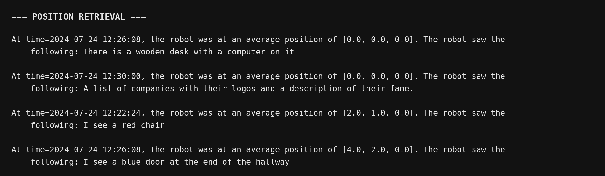
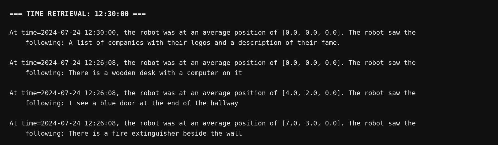
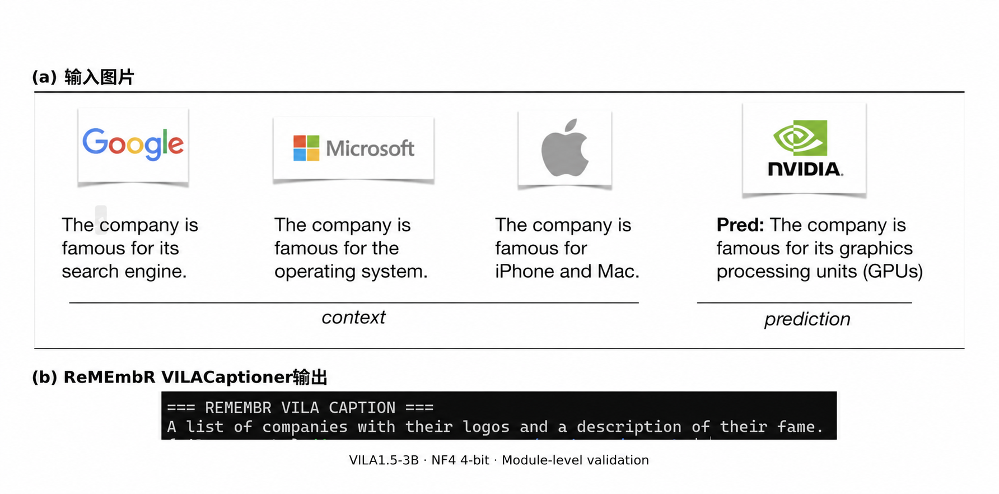
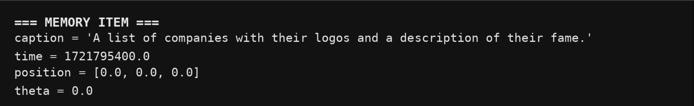
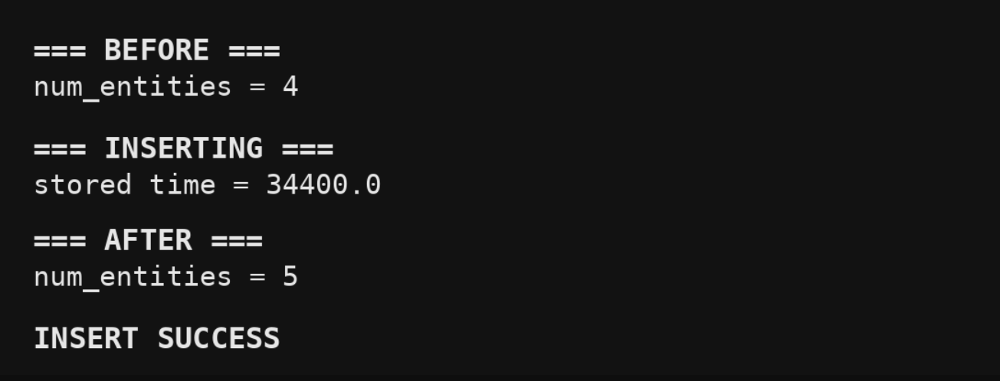

# 科研实习周报

**汇报周期：2026年9月22日**  
**研究任务：ReMEmbR 论文复现与机器人长时程时空记忆系统搭建**

---

## 一、本周工作概述

本周围绕论文 **ReMEmbR: Building and Reasoning Over Long-Horizon Spatio-Temporal Memory for Robot Navigation** 开展了从环境搭建到核心模块验证的完整复现工作：

```text
WSL2 / Docker / Conda 环境
↓
Milvus 长期记忆数据库
↓
MemoryItem 最小测试
↓
文本 / 位置 / 时间三种 Retrieval
↓
Ollama + Qwen3 本地 LLM
↓
ReMEmbRAgent Tool Calling
↓
Memory → Retrieval → Reasoning
↓
VILA1.5-3B 视觉模型适配
↓
ReMEmbR VILACaptioner
↓
Image → Caption
↓
Caption → MemoryItem
↓
MemoryItem → Milvus
↓
VILA 新视觉记忆的 Text / Position / Time Retrieval
```

截至本次汇报，已在核心模块分别验证的基础上，将视觉记忆链路与 Agent 推理链路接通，完成自采短视频的本地轻量化端到端问答验证，并开展检索数量对照实验及原视频核验。当前仍存在视觉描述和推理错误，尚未完成论文标准数据定量评测及真实机器人闭环；下一步将开展问题归因与 NaVQA 小规模评测，并逐步推进 ROS Bag 数据接入。

---

## 二、本周完成的全部论文复现工作

### 1. 环境配置

#### （1）搭建 ReMEmbR 基础运行环境

本周首先完成了论文复现所需的基础软件环境配置，包括：

- WSL2 Ubuntu 22.04；
- Miniconda / Conda 环境；
- Docker；
- MilvusDB；
- ReMEmbR 项目源码；
- Ollama；
- 本地 Qwen3 模型；
- VILA 源码与独立推理环境。

由于当前电脑：

```text
显存：约 8GB
物理内存：16GB
```

与论文及原项目代码发布时期使用的软件栈存在差异，因此本周复现过程中并未完全照搬原始依赖，而是根据 RTX 5060 / Blackwell `sm_120` 的实际情况重新适配 GPU Runtime。

最终保留了：

```text
VILA 历史源码 / ReMEmbR API
Transformers 4.37.2 等关键上层接口
```

同时采用：

```text
Torch 2.14 + CUDA 13
TorchVision 0.29
```

以保证 RTX 5060 能够正常完成 CUDA 实算。

---

#### （2）调整 WSL 内存与网络环境

当前电脑内存仍为 16GB，为保证 VILA 模型加载时有足够的 CPU 内存，本周调整了 WSL2 的资源限制：

```ini
[wsl2]
memory=10GB
swap=8GB
networkingMode=mirrored
dnsTunneling=true
autoProxy=true
```

调整后，WSL 实际可见：

```text
约 9.7 GiB RAM
8.0 GiB Swap
```

该配置最终成功支撑 VILA1.5-3B 的 NF4 4-bit 加载与推理。

---

### 2. 数据库检索与大模型问答链路复现

#### （1）搭建 Milvus 长期时空记忆模块

本周完成了 MilvusDB 的 Docker 部署，并梳理 ReMEmbR 中 `MemoryItem` 的数据结构。

`MemoryItem` 包含：

```text
caption
time
position
theta
```

其中：

- `caption`：机器人看到的视觉语义描述；
- `time`：该记忆对应的时间；
- `position`：机器人空间位置；
- `theta`：机器人朝向。

首先使用手工构造的 MemoryItem 进行最小测试，将多条示例记忆写入 Milvus，例如：

```text
There is a wooden desk with a computer on it
I see a red chair
I see a blue door at the end of the hallway
There is a fire extinguisher beside the wall
```

通过这一步确认：

```text
MemoryItem
→ Embedding
→ Milvus 存储
```

链路可以正常工作。

---

#### （2）完成 Text / Position / Time 三种记忆检索

在手工 MemoryItem 基础上，本周分别验证了 ReMEmbR 的三种核心检索方式：

#### 完成 VILA 新视觉记忆的文本检索

针对新加入的 VILA 视觉记忆，使用语义问题：

```text
What companies and logos did the robot see?
```

进行文本检索。

新增视觉记忆排在返回结果第一位：



**图3(a) VILA 新视觉记忆的文本语义检索结果。**

说明 VILA 生成的视觉描述已经可以被正常编码为 embedding 并用于语义检索。

---

#### 完成 VILA 新视觉记忆的位置检索

本次测试将新视觉记忆的位置设置为：

```text
[0.0, 0.0, 0.0]
```

对该位置进行查询后，新加入的 VILA 视觉记忆能够被正常返回。

结果如下：



**图3(b) VILA 新视觉记忆的位置检索结果。**

由于已有测试记忆也位于相同坐标，因此多条同位置记忆同时排在前列，结果符合预期。

---

#### 完成 VILA 新视觉记忆的时间检索

本次测试视觉记忆设定时间为：

```text
12:30:00
```

调用时间检索后，新加入的 VILA 视觉记忆排在第一位：



**图3(c) VILA 新视觉记忆的时间检索结果。**


---

#### （3）完成本地 LLM 与 ReMEmbRAgent 基础链路

本周完成 Ollama 本地部署，并使用：

```text
Qwen3
```

作为本地 LLM。

随后验证了 ReMEmbRAgent 的基本 Tool Calling 机制：

```text
User Question
↓
ReMEmbRAgent
↓
选择 Retrieval Tool
↓
Milvus 检索
↓
获取相关 Memory
↓
LLM Reasoning
↓
Final Answer
```
---

### 3. 视频到数据库的视觉记忆构建

#### （1）完成 VILA1.5-3B 下载与 NF4 4-bit 推理

本周下载并部署：

```text
Efficient-Large-Model/VILA1.5-3b
```

模型目录总大小约：

```text
5.9GB
```

为适应 8GB 显存，采用：

```text
NF4 4-bit
Double Quantization
FP16 Compute
```

进行推理。

经过模型加载参数与 protobuf 等兼容问题处理后，最终成功完成模型加载。

实际测试：

```text
model class = LlavaLlamaModel
context_len = 2048
CUDA allocated ≈ 2.43 GiB
CUDA reserved  ≈ 2.53 GiB
```

这说明当前 16GB RAM + 8GB VRAM 的硬件仍可以继续推进 VILA1.5-3B 的最小复现。

---

#### （2）完成 VILA 单图 Caption 测试

通过 VILA direct builder 完成单图 caption 测试。

最终，ReMEmbR 自己的 `VILACaptioner` 已能够正常输出视觉描述。

测试结果如下：



**图1 VILA视觉描述模块功能验证。**  
(a) 输入图片；(b) ReMEmbR `VILACaptioner` 输出结果。

本次输出：

```text
A list of companies with their logos and a description of their fame.
```

这里使用的是 VILA 官方示例图，主要目的是验证视觉模块是否能够正常工作，并非最终导航场景实验。

---

#### （3）完成 VILA Caption → MemoryItem

在 `VILACaptioner` 输出成功后，本周继续将 VILA 生成的 caption 转换为 ReMEmbR 的 MemoryItem。

本次测试 MemoryItem 包含：

```text
caption = VILA 生成结果
time = 测试时间
position = [0.0, 0.0, 0.0]
theta = 0.0
```

结果如下：



**图2(a) VILA Caption 构造成 MemoryItem。**

这里的时间、位置和朝向均为测试设定，主要用于验证接口；后续 ROS Bag 阶段会替换为机器人真实时间戳与位姿。

---

#### （4）完成 VILA MemoryItem → Milvus

将上述 VILA 视觉记忆写入：

```text
memory_demo_timefix
```

collection。

写入前：

```text
num_entities = 4
```

写入后：

```text
num_entities = 5
```

并得到：

```text
INSERT SUCCESS
```

结果如下：



**图2(b) VILA 视觉记忆写入 Milvus。**

至此，已打通：

```text
Image
→ VILA
→ Caption
→ MemoryItem
→ Milvus
```

---


### 4. 完成自采视频轻量化全流程验证

在上述模块验证的基础上，本周进一步使用自采视频，将视频采样、VILA 描述生成、MemoryItem 构造、Milvus 入库、Agent 工具检索及 Qwen 回答生成串联起来，完成本地轻量化端到端运行。

#### （1）完成短视频记忆构建与自动问答

本次采用 VILA1.5-3B NF4 4-bit 和 Qwen3-4B-Instruct，处理自采视频的前 24 秒，每 3 秒划分一个片段、每段采样 2 帧，共生成 8 条视觉记忆。完成记忆入库及读回核验后，围绕物体属性、记录观察位置、最近时间场景和事件先后顺序开展问答，并保存最终回答及完整工具调用轨迹。

#### （2）核验原视频与视觉描述

主要对象能够被识别，但部分属性、类别和空间关系描述存在偏差：

- 走廊和饮水设备的主体识别基本符合画面；
- 三个垃圾桶实际为黄色桶盖、深色桶身；
- 水槽实际为白色台面上的不锈钢双槽；
- 原描述中的“蓝桶／装食物的蓝碗”更准确地对应灰色桶配蓝色网篮，内有疑似茶叶渣；
- 场景更符合茶水／洗涤区，画面不足以确认其为浴室。
---

## 三、本周复现过程中解决的主要问题

### 1. 新 GPU 与旧 VILA 软件栈不兼容

原始 VILA 环境依赖较旧的 Torch / CUDA / FlashAttention 版本，而当前机器为 RTX 5060 Blackwell。

解决思路：

```text
保留 ReMEmbR 所需历史 VILA API
+
更新底层 GPU Runtime
+
绕开旧 FlashAttention / DeepSpeed 强依赖
```

最终成功。

### 2. 16GB 内存下模型加载压力较大

通过：

```text
WSL memory = 10GB
swap = 8GB
+
VILA1.5-3B NF4 4-bit
```

解决当前硬件限制。


### 3. VILA 与 ReMEmbR 主流程的依赖环境隔离

为分别维护视觉推理与记忆检索所需的依赖，采用两个 Conda 环境：
```
vila-remembr 负责视觉描述生成

remembr 负责记忆存储、检索及 Agent 问答
```
通过中间文件传递结果，降低依赖调整对已有功能的影响。

### 4. 端到端联调中的连接与回答可靠性问题

在自采视频的端到端测试中，VILA 已完成描述生成，以及记忆入库及后续问答流程。

流程打通后，进一步发现以下问题：

* 视觉描述存在物体类别、颜色及空间关系偏差；
* Agent 存在重复查询，缺少另一对象的证据时未主动补充检索；
* 已返回相关时间记录，但后续回答仍出现时间选择错误和场景混淆；
* 部分回答输出了缺乏证据支持的朝向。

目前已完成检索数量对照实验和原视频核验，确认上述现象存在，但尚未完全区分模型能力、提示词和代码实现各自的影响。该问题尚未解决。

---

## 四、下一步工作规划

下一阶段将使用论文配套的官方数据集开展验证，获取并核对 CODa 数据及 NaVQA 问答标注，先选取小规模样本，检查重复检索、缺失证据补查失败及时间推理错误等问题是否仍然存在。

在评测流程稳定后，逐步扩大至论文规定的数据范围，按照对应评测方法记录回答质量、推理耗时及失败类型，并与论文结果进行对照。明确记录本地模型与论文配置的差异，以使用官方数据完成论文定量复现为目标，推进最终复现工作。
