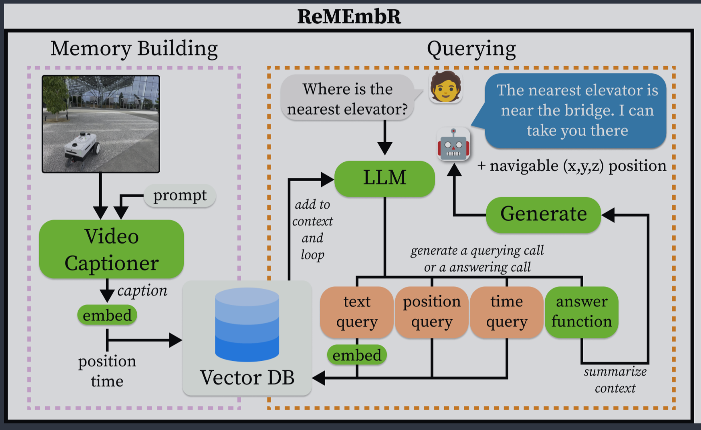

# 科研实习周报

**汇报周期：2026年9月29日**  
**研究任务：ReMEmbR 论文复现、云端模型接入、GPU 服务器部署及机器人长时程记忆相关论文调研**

---

## 一、Remembr复现完成的工作


### 1. 完成云端大模型 API 接入与连接测试

#### （1）完成 API 基础配置

#### （2）将云端模型接入 ReMEmbRAgent

### 2. 完成远程 GPU 服务器连接与基础环境验证

#### （1）完成 GPU 服务器 SSH 连接

#### （2）完成 CUDA / PyTorch GPU 运行验证

### 3. 推进 VILA 服务器端部署

当前采用的思路为：

```text
本地电脑
├─ ReMEmbR 主程序
├─ Milvus
├─ Memory / Retrieval
└─ Agent

远程 GPU 服务器
└─ VILA / 视觉模型推理
```

---

## 二、本周相关论文调研

### 1. 长期时空记忆
---

### AstraNav-Memory: Contexts Compression for Long Memory | CVPR 2026

**问题：**  
机器人连续执行多个导航任务时，需要保留并利用此前观察到的场景，而不是每次重新探索环境。

**Challenge：**  
历史图像持续增加后，直接输入大模型会带来上下文长度、显存和计算开销快速增长；但过度压缩又可能丢失物体、空间布局等对导航有用的信息。

**创新点：**  
提出面向导航任务的**视觉上下文压缩机制**，将大量历史图像压缩为更少的视觉 token，并与导航策略联合训练，在降低计算开销的同时尽量保留对导航决策有用的空间与语义线索。

---

### Explore with Long-term Memory: A Benchmark and Multimodal LLM-based Reinforcement Learning Framework for Embodied Exploration | CVPR 2026

**问题：**  
机器人在长时间、多目标探索中，不仅需要保存历史记忆，还需要根据当前任务主动判断“应该查询哪些记忆”，并利用检索结果继续导航和问答。

**Challenge：**  
完整历史无法一次性输入模型；单次检索可能检索到错误或不充分的信息，而错误检索又会进一步影响后续决策。

**创新点：**  
将**主动记忆检索直接纳入机器人决策过程**，由模型主动生成查询并调用记忆检索工具，并利用强化学习进一步训练模型学习如何检索以及如何利用检索结果完成决策，实现“记忆—推理—探索”闭环。

---
### 2. 动态场景记忆
---
### DynaMem: Online Dynamic Spatio-Semantic Memory for Open World Mobile Manipulation | ICRA 2025

**问题：**  
传统开放词汇移动操作系统通常默认环境静态，但真实环境中的物体会被移动、增加或拿走，旧地图可能因此失效。

**Challenge：**  
机器人初始没有完整地图，环境中的物体和障碍物又可能持续变化；同时，当目标暂时不存在于当前记忆中时，机器人仍需要继续探索未知区域。

**创新点：**  
构建**可在线更新的动态 3D 空间语义记忆**。机器人能够根据新观测持续增加、更新或删除历史记忆，使记忆反映物体的出现、移动和消失，而不是将第一次建图得到的环境永久固定下来。

---

### Embodied VideoAgent: Persistent Memory from Egocentric Videos and Embodied Sensors Enables Dynamic Scene Understanding | ICCV 2025 

**问题：**  
机器人长期视频理解不仅需要知道“以前看见过什么”，还需要持续记录物体的位置、状态及其随时间发生的变化，并使用这些记忆完成后续任务。

**Challenge：**  
同一物体可能从不同视角反复出现，并经历拿起、放下、遮挡等状态变化，因此系统需要解决跨时间物体身份关联和动态状态更新问题。

**创新点：**  
提出 **Persistent Object Memory**，持续维护物体的 3D 位置、状态、关系及视觉特征；同时结合 VLM 对动作和状态变化进行判断，使机器人记忆能够随着真实环境中的物体变化持续更新，并由 LLM Agent 调用这些记忆完成查询和任务执行。

---